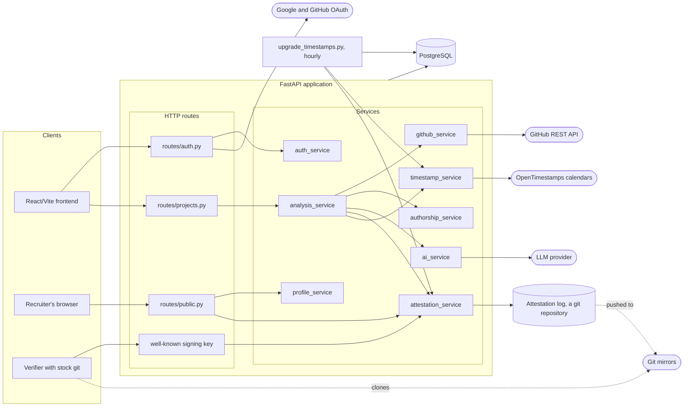
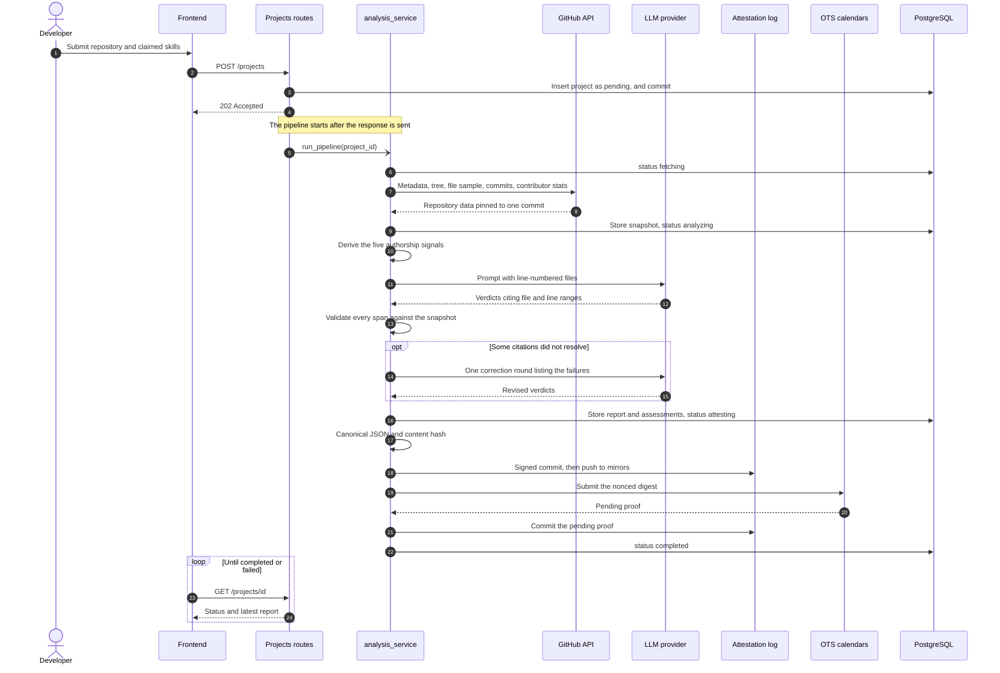
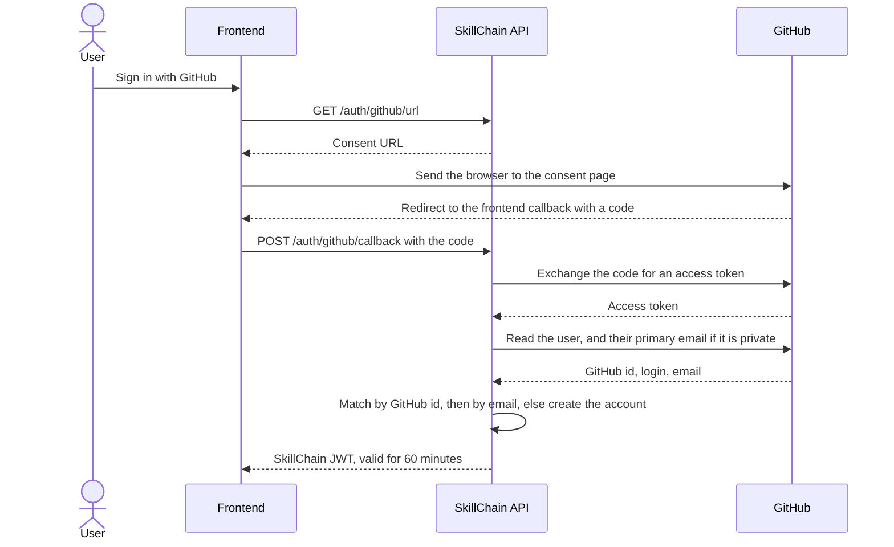

# 3. Architecture

SkillChain is one FastAPI application, a PostgreSQL database, a git repository on the server's
disk that holds the attestation log, and a scheduled job. Everything else it talks to is
external: GitHub, a language model, the OpenTimestamps calendars, and the git hosts that mirror
the log.

## 3.1 Components

The application is layered, and each layer only calls the one beneath it:

| Layer | Does | Does not |
|---|---|---|
| `routes/` | HTTP: authentication, request validation, response shaping, status codes | Business rules, or network calls — with one exception, below |
| `services/` | Everything the product does | Know it is behind HTTP |
| `models/`, `db/` | Tables, constraints, sessions | Logic beyond what the database enforces |

The exception is sign-in: the OAuth callbacks in `routes/auth.py` exchange the provider's code
for a token themselves, and hand the result to `auth_service` to find or create the account.

Two services are the heart of it:

- **`analysis_service`** orchestrates one analysis from submission to published report. It
  owns no logic of its own beyond sequencing, statuses and failure handling.
- **`attestation_service`** turns a stored report into a canonical document, a content hash,
  and a signed commit in the log.

The others each do one thing: `github_service` fetches, `authorship_service` derives signals
with no network and no model, `ai_service` asks the model and validates what comes back,
`timestamp_service` talks to the calendars, and `profile_service` aggregates reports into a
profile on read.

## 3.2 Submitting and analysing a project

The row is committed before the task is scheduled, because the pipeline opens its own database
session and would not see a row still held in the request's transaction.

### What each stage does when it fails

The layers fail independently and on purpose. A repository that cannot be read, or a model that
never returns anything usable, fails the run. A failure to publish does not: the analysis has
been paid for and is still worth serving.

| Stage | Failure | Outcome |
|---|---|---|
| Fetch | GitHub answers 404 | Project `failed`. Without a token GitHub answers 404 for private repositories too, so the message says the repository is missing *or* private |
| Fetch | Empty repository | Project `failed` |
| Fetch | Linked token rejected by GitHub | Project `failed`, saying GitHub rejected the stored token |
| Fetch | Rate limit reached | Project `failed`, saying which limit and when it resets |
| Analyse | The model's reply cannot be parsed, or the provider errors | Project `failed` |
| Analyse | Cited lines do not exist | One correction round. A skill still left with no resolvable evidence is stored as unverified, with the reason, and the run continues |
| Attest | The commit cannot be made | Report `attestation_status: failed`; project still `completed` |
| Attest | A mirror rejects the push | Nothing fails. The commit exists locally; status is `committed` rather than `mirrored` |
| Timestamp | No calendar accepts the digest | Report `timestamp_status: failed`; project still `completed` |
| Any | An unexpected exception | Project `failed` with a generic message; the detail goes to the server log, not the user |

Every failure message is written for the person who submitted the project, and the pipeline
never raises into the request that started it.

## 3.3 Signing in

Google follows the same two steps. Matching by email is what links the two providers into one
account.

## 3.4 The attestation log

The log is an ordinary git repository on the server. It is written by SkillChain and read by
anyone.

**The document.** Each report is serialised to a canonical JSON document, schema
`skillchain.report/v1`. It holds what a reader needs to check the verdict and re-run it — the
repository and exact commit, the submitter's public GitHub username and role, the model and
prompt version, the score, the summary, every skill with its evidence, and the authorship
signals — and nothing else. The model's raw response, the token usage and the submitter's
email are left out, since the document may be pushed to public mirrors.

**Canonical bytes.** Keys are sorted, there is no insignificant whitespace, text is UTF-8, and
the file ends with one newline. Datetimes are normalised to UTC, because PostgreSQL and SQLite
return them differently and the bytes must not depend on the database. Re-serialising the same
report always gives identical bytes, which is what lets the hash serve as its identity.

**Content addressing.** The report's `content_hash` is the SHA-256 of those bytes, and the file
lives at `reports/<first two characters>/<hash>.json`, sharded the way git shards its own
objects so no directory grows to hundreds of thousands of entries.

**Signed commits.** One commit per report, signed with an SSH key through git's own
`gpg.format=ssh`. The root commit is signed too, so "every commit in this log is signed" holds
without an exception. Commit messages carry the content hash, the repository commit, the model
and the prompt version, so `git log` alone says what each commit attests.

**No line-ending translation.** The repository carries `reports/** -text` in `.gitattributes`
and sets `core.autocrlf=false`. The committed bytes must be exactly the bytes that were hashed,
and a Windows checkout with automatic line-ending conversion would otherwise rewrite them.

**Append-only.** Nothing is amended, rebased or deleted. Re-analysis writes a new report and a
new commit. Deleting a project from the database leaves its reports in the log; a log that
could be edited on request would prove nothing.

**Idempotent.** Appending a document whose bytes are already committed returns the existing
commit instead of making an empty one, so retrying after a partial failure cannot fork the log.

**Mirrored.** After each commit the log is pushed to every remote in `ATTESTATION_REMOTES`, best
effort. A mirror being unreachable is not a failure of the attestation; the commit already
exists and can be pushed later. Several independent mirrors mean no single host can erase the
log.

**Timestamped.** The report's hash is combined with a random nonce, hashed again, and submitted
to the OpenTimestamps calendars. The pending proof they return is committed beside the report
as `reports/<xx>/<hash>.ots`. Hours later, once Bitcoin has confirmed, the upgrade job asks the
calendars again and commits the completed proof in a second commit — recording the upgrade
rather than overwriting the weaker proof that came first.

**Published key.** The public half of the signing key is served at
`/.well-known/skillchain-signing-key` in `allowed_signers` form, so anyone can check a
signature without asking for the key. The private half never leaves the server.

How a reader checks all of this is in [09](09-verifying-a-report.md).

## 3.5 Configuration

Everything is read from the environment, from a `.env` file locally. `.env.example` lists every
variable.

| Variable | Purpose |
|---|---|
| `DATABASE_URL` | The PostgreSQL connection |
| `SECRET_KEY`, `ALGORITHM`, `ACCESS_TOKEN_EXPIRE_MINUTES` | JWT signing and lifetime |
| `GOOGLE_CLIENT_ID`, `GOOGLE_CLIENT_SECRET` | Google sign-in |
| `GITHUB_CLIENT_ID`, `GITHUB_CLIENT_SECRET` | GitHub sign-in |
| `FRONTEND_URL` | Where OAuth providers redirect back to |
| `XAI_API_KEY`, `AI_MODEL` | The language model |
| `ATTESTATION_ENABLED` | Whether reports are committed to the log. Off by default, so local development and tests need no key |
| `ATTESTATION_REPO_PATH` | Where the log lives on disk |
| `ATTESTATION_SIGNING_KEY_PATH` | The SSH private key. The log refuses to run unsigned when enabled: an attestation nobody can verify is worse than an honest failure |
| `ATTESTATION_REMOTES` | Comma-separated mirrors |
| `OTS_ENABLED` | Whether reports are timestamped. Off by default |
| `OTS_CALENDARS` | Calendars to use; empty means the public defaults |

## 3.6 Security

- **Authorisation is by ownership.** Every project route loads the project through a check that
  it belongs to the caller, and answers `404` otherwise.
- **Prompt injection through skill names is closed off.** Skill names are placed into the model's
  prompt, so they are limited to short identifiers with no newlines or quotes.
- **A pasted token is refused.** A repository URL containing credentials is rejected rather than
  stored.
- **Internal data stays internal.** The model's raw response, token usage and the stored GitHub
  token are never returned by any endpoint.
- **Only a nonced hash reaches the calendars.** No report content leaves the server for
  timestamping.
- **Git never prompts.** Pushes run with terminal prompts disabled and SSH in batch mode, so an
  unreachable or misconfigured mirror fails fast instead of hanging the pipeline.

## 3.7 Known limitations

- **Work in flight does not survive a restart.** The pipeline runs in the API process. A project
  caught mid-analysis stays in its in-flight status, and since re-analysis is refused while a run
  is in flight, it can only be deleted.
- **Failed publication is not retried.** A report whose attestation or timestamp failed keeps
  that status. Appending is idempotent precisely so that a retry would be safe, but nothing
  performs one yet; the upgrade job only completes proofs that are already pending.
- **The write lock is per process.** Commits to the log are serialised within the API process,
  but the upgrade job is a separate process writing to the same repository. If the two collide,
  git refuses one of them. When the loser is the API, that report's attestation is recorded as
  failed — and, per the previous point, stays that way.
- **The served verify commands are incomplete.** See [09](09-verifying-a-report.md).
