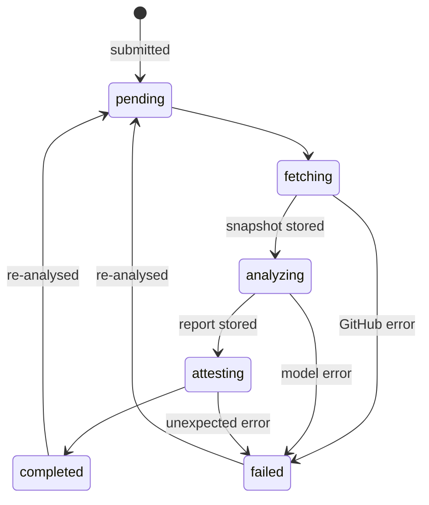
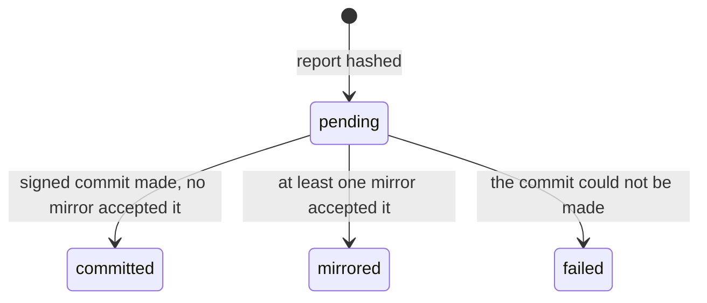
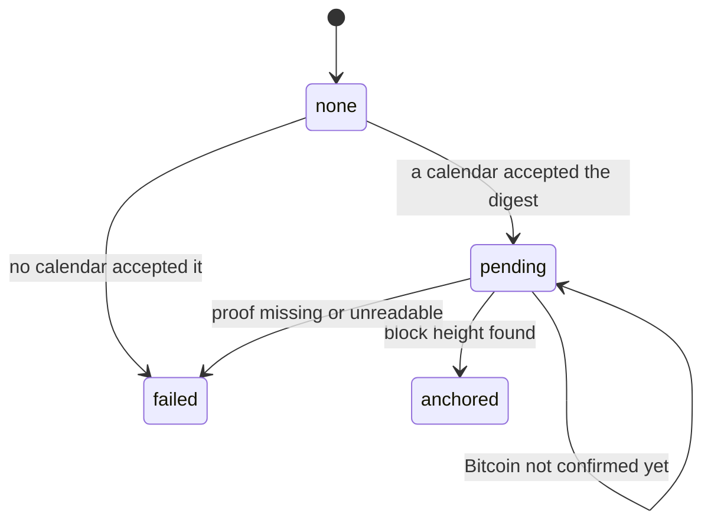

# 4. Database

SkillChain stores five tables in PostgreSQL 18. Locally the database runs in Docker with its
data on a named volume; a hosted deployment points `DATABASE_URL` at managed PostgreSQL and
nothing else changes. The schema is managed by Alembic, in two migrations: a baseline for
users and projects, and the analysis pipeline's tables.

The tests run the same models against in-memory SQLite. SQLite ignores foreign keys unless
asked, so the test fixtures switch them on; otherwise the cascades below would be silently
absent under test and present only in production.

## 4.1 Entity-relationship diagram

```mermaid
erDiagram
    USERS ||--o{ PROJECTS : submits
    PROJECTS ||--o{ REPO_SNAPSHOTS : "is fetched as"
    REPO_SNAPSHOTS ||--o| ANALYSIS_REPORTS : "is analysed into"
    ANALYSIS_REPORTS ||--o{ SKILL_ASSESSMENTS : contains

    USERS {
        string id PK
        string email UK
        string google_id UK
        string github_id UK
        string github_username
        string github_access_token
        string display_name
        string avatar_url
        string profile_slug UK
        bool profile_is_public
        bool is_active
        datetime created_at
    }

    PROJECTS {
        string id PK
        string user_id FK
        string title
        string description
        string github_repo_url
        string repo_owner
        string repo_name
        string live_demo_url
        json skills_claimed
        string role_in_project
        string status
        text error_message
        string visibility
        datetime submitted_at
    }

    REPO_SNAPSHOTS {
        string id PK
        string project_id FK
        string commit_sha
        string default_branch
        json languages
        json topics
        int stars
        int forks
        int commit_count
        int user_commit_count
        text readme_content
        json file_tree
        json sampled_files
        json commit_history
        json contributor_stats
        string fetch_mode
        datetime fetched_at
    }

    ANALYSIS_REPORTS {
        string id PK
        string repo_snapshot_id FK,UK
        string model_name
        string prompt_version
        int overall_trust_score
        text summary
        json authorship_signals
        text raw_response
        int duration_ms
        json token_usage
        datetime created_at
        string content_hash
        string attestation_commit_sha
        string attestation_status
        datetime attested_at
        string timestamp_status
        datetime anchored_at
        int bitcoin_block_height
    }

    SKILL_ASSESSMENTS {
        string id PK
        string report_id FK
        string skill_name
        bool claimed
        bool verified
        string level
        int confidence
        text reason
        json evidence
    }
```

A snapshot has at most one report. It can have none: if the analysis fails after the
repository was fetched, the snapshot stays as the record of what was seen, with nothing
said about it.

## 4.2 Entities

### users

An account, reached by Google, by GitHub, or by both once linked. Email is the join: signing
in with the second provider under the same address attaches it to the existing account
rather than creating another.

| Column | Meaning |
|---|---|
| `github_username` | The GitHub login, used to find the submitter's own commits in a repository's history |
| `github_access_token` | The user's OAuth token, used to fetch at the authenticated rate limit. Stored in plaintext today — see [4.6](#46-open-questions) |
| `profile_slug` | The address of the public profile, `/public/profiles/{slug}` |
| `profile_is_public` | Whether that profile is served. Withdrawing it keeps the slug, so a profile that returns returns at the same address |

### projects

A repository submitted for assessment, and the lifecycle of its analysis.

| Column | Meaning |
|---|---|
| `github_repo_url` | Normalised to `https://github.com/{owner}/{repo}` on submission |
| `repo_owner`, `repo_name` | Parsed from the URL once, so the pipeline never re-parses it |
| `skills_claimed` | The skills the submitter says the repository shows, deduplicated case-insensitively |
| `status` | Where the analysis is; see [4.4](#44-status-lifecycles) |
| `error_message` | Why an analysis failed, in words written for the submitter |
| `visibility` | `private` or `public`. Only a public project reaches a public profile or the public report routes |

### repo_snapshots

Exactly what was fetched from GitHub, pinned to one commit. This table is what makes a report
reproducible: it holds the inputs the model saw, not a summary of them.

| Column | Meaning |
|---|---|
| `commit_sha` | The commit every other column describes |
| `sampled_files` | The full text of up to 15 files, 100 KB in total — kept so the cited line ranges can still be shown after the repository changes or disappears |
| `file_tree` | The repository's paths and sizes, used to choose the sample and to detect scaffolding |
| `commit_history` | Metadata for the 100 most recent commits: messages, authors, trailers, timestamps |
| `contributor_stats` | Per-contributor weekly additions, deletions and commits |
| `user_commit_count` | The submitter's commits, when their GitHub login is known |
| `fetch_mode` | `authenticated` with the user's token, or `public` without one |

### analysis_reports

One model's verdict on one snapshot, with its provenance and its publication state.

| Column | Meaning |
|---|---|
| `model_name`, `prompt_version` | Which model and which prompt produced the verdict |
| `overall_trust_score` | 0–100 |
| `authorship_signals` | The five deterministic signals; see [10](10-authorship-signals.md) |
| `raw_response` | The model's reply verbatim, kept for audit and never served publicly |
| `token_usage`, `duration_ms` | Cost and latency of the run; internal |
| `content_hash` | sha256 of the report's canonical JSON — its identity and its address in the log |
| `attestation_commit_sha` | The signed commit that carries the report |
| `attestation_status`, `timestamp_status` | Publication progress; see [4.4](#44-status-lifecycles) |
| `anchored_at`, `bitcoin_block_height` | When and where Bitcoin confirmed the report, once it has |

### skill_assessments

One verdict on one skill.

| Column | Meaning |
|---|---|
| `claimed` | Whether the submitter claimed the skill, or the model volunteered it (at most five extra) |
| `verified` | True only if at least one piece of evidence resolved to real lines |
| `level` | `beginner`, `intermediate` or `advanced` |
| `confidence` | 0–100 |
| `evidence` | A list of spans. `source`, `manifest` and `readme` evidence cites a file and a line range; `commits` and `languages` evidence describes the repository as a whole and cites no file |

### The skill profile is not a table

A developer's public profile is computed each time it is read, from the newest report of each
of their public, completed projects. A stored profile would be a cached total that could fall
out of step with the reports it summarises; computing it on read means there is nothing to
keep in step.

## 4.3 Constraints

The database enforces the rules that must hold whatever code writes to it.

**Check constraints**

| Table | Rule |
|---|---|
| `projects` | `status` is one of `pending`, `fetching`, `analyzing`, `attesting`, `completed`, `failed` |
| `projects` | `visibility` is `private` or `public` |
| `repo_snapshots` | `fetch_mode` is `authenticated` or `public` |
| `analysis_reports` | `attestation_status` is one of `pending`, `committed`, `mirrored`, `failed` |
| `analysis_reports` | `timestamp_status` is one of `none`, `pending`, `anchored`, `failed` |
| `analysis_reports` | `overall_trust_score` is between 0 and 100 |
| `skill_assessments` | `level` is one of `beginner`, `intermediate`, `advanced` |
| `skill_assessments` | `confidence` is between 0 and 100 |

**Uniqueness**

| Table | Columns | Why |
|---|---|---|
| `users` | `email`, `google_id`, `github_id`, `profile_slug` | One account per identity; one owner per profile address |
| `analysis_reports` | `repo_snapshot_id` | One report per snapshot. Re-analysis takes a fresh snapshot rather than overwriting, so earlier verdicts survive |
| `skill_assessments` | `report_id`, `skill_name` | One verdict per skill per report |

**Foreign keys** all cascade on delete, down the whole chain: deleting a user removes their
projects, deleting a project removes its snapshots, and so on to the assessments. The models
declare `passive_deletes`, which leaves the work to the database rather than having the ORM
load every child row just to delete it.

Deleting a project does not remove its reports from the attestation log. The log is
append-only by design; the database forgets, the log does not.

**Indexes** cover the lookups the application makes: `projects.user_id`,
`repo_snapshots.project_id`, and `analysis_reports.content_hash`.

**Naming.** Every constraint is named by convention — `ck_<table>_<name>`,
`uq_<table>_<columns>`, `fk_<table>_<column>_<referred table>` — so Alembic can find and alter
them by name in later migrations instead of guessing at database-generated ones.

## 4.4 Status lifecycles

Three columns carry state machines. Each is constrained to its listed values, and each
transition is made by exactly one part of the code.

### Project status

Moved forward by the analysis pipeline, reset by re-analysis.

`attesting` means the report exists and is being published. A publishing failure does not
fail the project — the analysis was paid for and is still worth serving — so the project
moves to `completed` and the failure is recorded on the report instead. Re-analysis is refused
while the status is anything other than `completed` or `failed`, because two pipelines on one
project would race into the same columns.

### Attestation status

Set once per report, when the pipeline publishes it.

A report stays `pending` when attestation is switched off: it has its content hash, but it is
not in any log.

### Timestamp status

Set by the pipeline, then advanced by the upgrade job.

`pending` here is the normal state for the first few hours of every report's life: the
calendars hold the digest but Bitcoin has not confirmed the block that commits to it. The
upgrade job, `scripts/upgrade_timestamps.py`, asks again on each run. If it finds an anchor but
cannot commit the completed proof to the log, it leaves the report `pending` so the next run
retries, rather than claiming an anchor the log does not carry.

## 4.5 Design decisions

- **Snapshots keep file contents, not just paths.** A citation of lines 40–72 is only useful
  if lines 40–72 can be shown. The repository may be force-pushed, made private or deleted;
  the snapshot is what was read, and it is what the evidence refers to.
- **Re-analysis appends.** Each run takes a new snapshot and writes a new report. The old one
  remains readable, including publicly, so a developer cannot quietly retire a verdict they
  have already shared.
- **Timestamps are timezone-aware.** PostgreSQL returns aware datetimes and SQLite returns
  naive ones. The canonical form of a report normalises both to UTC, because the published
  bytes must not depend on which database produced them.
- **Structured data the database never queries is JSON.** Evidence, signals, the file tree and
  the commit history are read and written whole. Normalising them into tables would add joins
  to every read and buy nothing.

## 4.6 Open questions

- **`github_access_token` is stored in plaintext.** The options are to encrypt it at rest with
  a key held outside the database, to store only short-lived tokens, or to accept and document
  the risk. Undecided.
- **What the log publishes.** Today every report is attested, public project or not. Limiting
  the log to public projects would keep `visibility` meaningful beyond this database, since
  mirrors may be public. Undecided.
