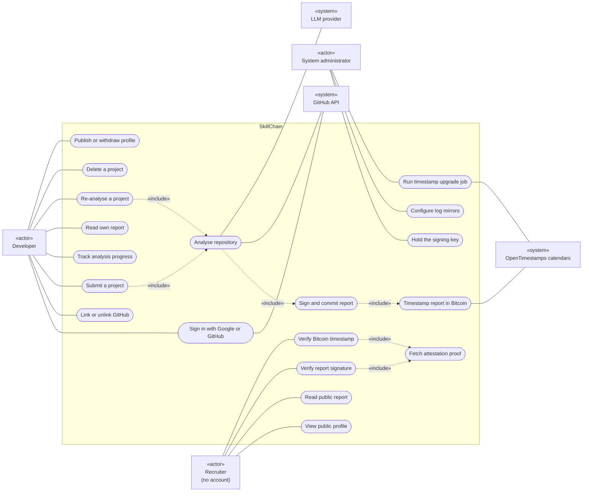
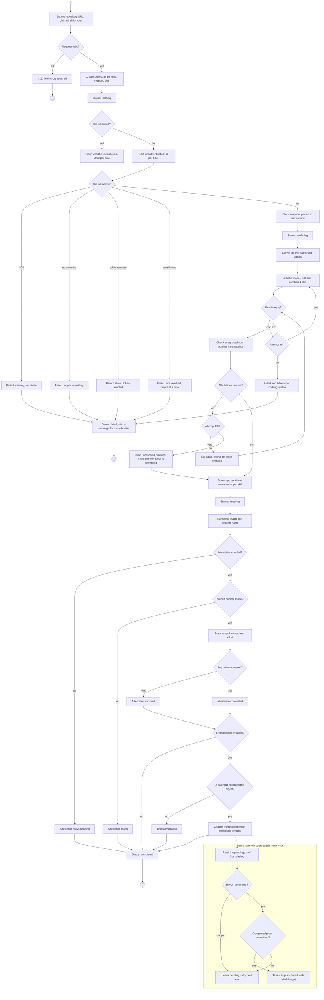
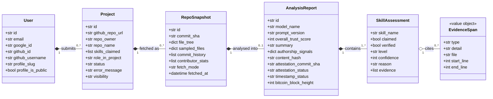
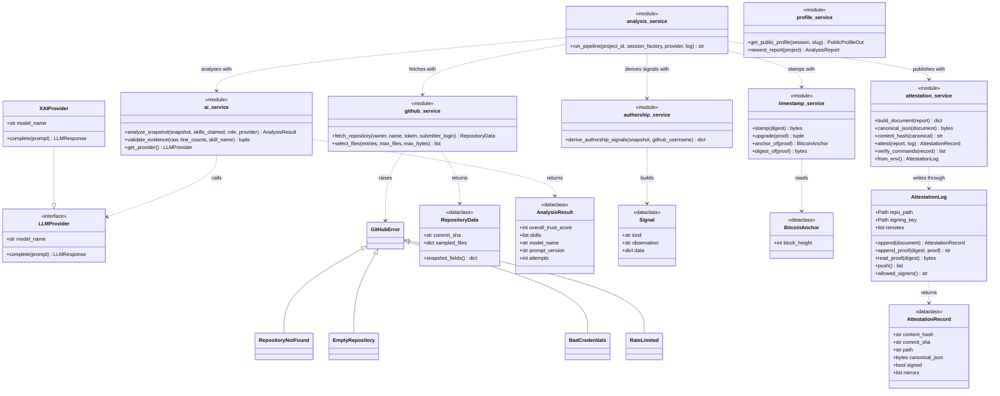

# 5. UML diagrams

Three views of the system: who uses it and for what (use case), what happens when a project is
analysed (activity), and how the code is organised (class). Each is drawn from the code as it
stands, not from the plan it began as.

The diagrams are written in Mermaid so they live beside the code and change with it. Mermaid has
no native use case notation, so that diagram uses the common stand-in: actors as boxes, use cases
as rounded ovals inside a system boundary, and `«include»` relationships as dashed arrows.

## 5.1 Use case diagram

**Actors.**

- **Developer** — the primary user. Signs in, submits repositories, reads what was said about
  them, and decides whether to publish.
- **Recruiter** — reads a profile and the reports behind it without an account, and can verify
  any report independently. Verification happens on the recruiter's own machine with stock git;
  SkillChain's part is serving the proof and the public key.
- **System administrator** — holds the signing key, chooses the mirrors, and schedules the job
  that completes Bitcoin anchors.
- **GitHub API, LLM provider, OpenTimestamps calendars** — external systems the analysis
  depends on. None of them is trusted for the integrity of a report: the evidence is checked
  against the snapshot, and the signature and anchor are checked by the reader.

**Relationships.** Submitting and re-analysing both include the analysis, which includes
publishing the report, which includes timestamping it. Verifying a signature and verifying a
timestamp both include fetching the proof from `/public/reports/{id}/attestation`.

## 5.2 Activity diagram — analysing a project

From submission to a published report, including every failure branch and the anchor that
completes hours later.

**Two attempts, two purposes.** The model is asked at most twice. An unusable reply — one that
cannot be parsed, or a provider error — is retried with the same prompt; if the second reply is
also unusable, the run fails. Citations that do not resolve are retried with a note listing
exactly which ones failed and why. The two share the budget, so a run whose first reply was
unusable gets no correction round.

**Publishing never fails the run.** Every branch after the report is stored leads to
`completed`. The failures are recorded on the report, and the project stays readable.

**Any unexpected exception** at any stage ends in `failed` with a generic message, the detail
going to the server log. It is left off the diagram because it can happen anywhere.

## 5.3 Class diagrams

The code is Python modules more than classes, and the diagrams say so rather than inventing
classes that do not exist. Service modules are drawn with the `«module»` stereotype and their
public functions; `LLMProvider` is drawn as an `«interface»` because it is a `Protocol`, which
any class with a matching `complete` method satisfies without inheriting from it.

### Domain model

The persistent entities, as mapped by SQLAlchemy. The full column list and constraints are in
[04](04-database.md).

Composition runs down the chain because deletion does: removing a user removes their projects,
and so on to the assessments, enforced by the database. An `EvidenceSpan` is not a table — it is
validated by a Pydantic model and stored inside the assessment's `evidence` column.

### Services and their collaborators

`analysis_service` depends on every other analysis service and nothing depends on it except the
routes, which is what makes it the orchestrator. Each of the others can be — and is — tested
without the rest. `profile_service` stands apart: it reads what the pipeline wrote and never
calls into it.
